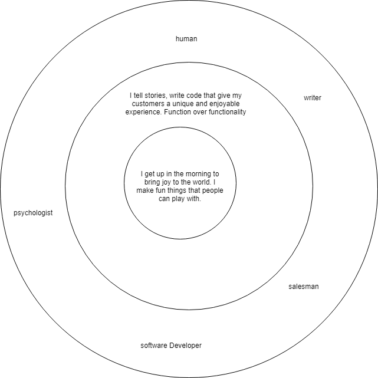
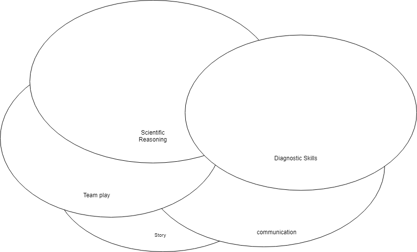
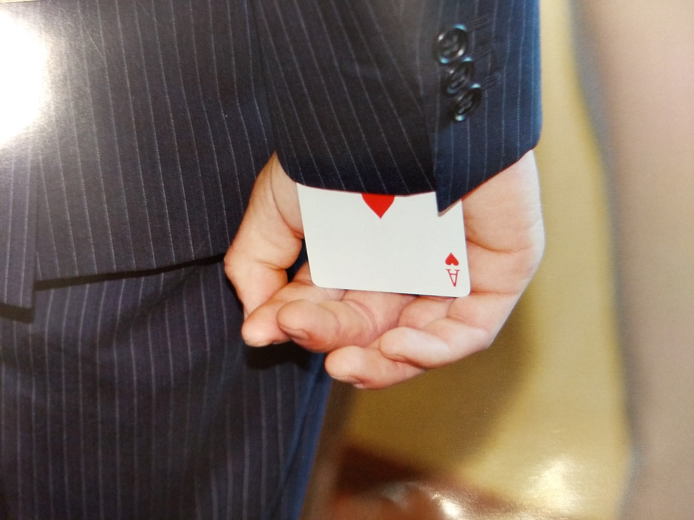

### Jeff Franken

I am a software developer interested in pattern recognition and machine learning. I have a background in clinical psychology and neuroscience, and also have experience in publishing, film production, and advertising sales.

I am a Java and Android developer in the process of becoming an Oracle-certified Java Developer I. Within the technology sector I have experience working with Log Sat for defense applications, database creation using Microsoft Access for a nonprofit, and point of sale configuration and database creation for a distributor of $32,000,000 in goods annually. 

My experience outside the technology field is varied, but I have had a history of working to steer teams of people to accomlish goals. Please see my resume for information.

[R&eacute;sum&eacute;](resume.md)

 

##### 3 quant accomplishments

Averaged 120k/ month in advertising sales (top in company) at GDS International  
Scored in the 95th percentile on LSAT and ACT/SAT  
Brought in 200,000k in financing for an independent documentary.  

##### 3 qualitative features

Like, super amazing sense of humor, which can get offensive.  
Ability to reconceptualize problems and discover new solutions, sometimes reinventing the wheel.  
Ability to communicate difficult subjects well, and lead teams effectively, which can make me overbearing and lecturing.  

Right now, the trick I have up my sleeve is a heart. I’m a passionate man and that passion can become a superpower when I channel it into my work. It is the source of my creativity and gives me the stamina to last through difficult delivery schedules.

The goal that I’m aspiring to as a higher level of understanding.  I want to know how it all works, and software development touches on everything in our lives today. It’s a field where knowing a little bit about everything can make you an expert in this very powerful something. The work itself is my goal: I want to enjoy what I do, and I want what I do to bring joy to the world, whether it’s a fun new game or an office productivity suite that can make tedious tasks less painful.

